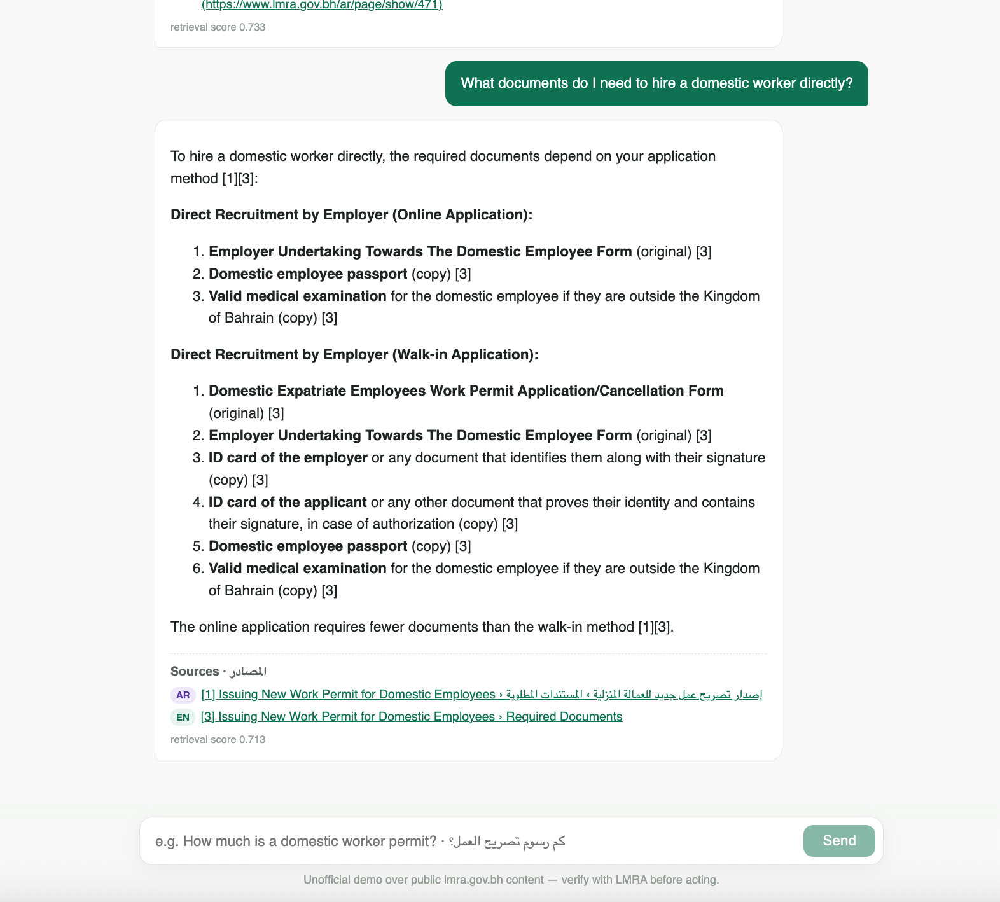
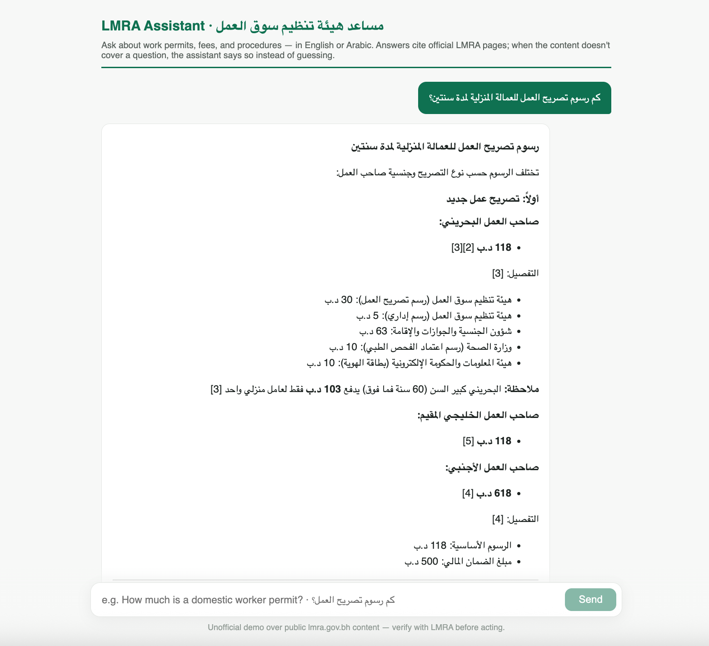
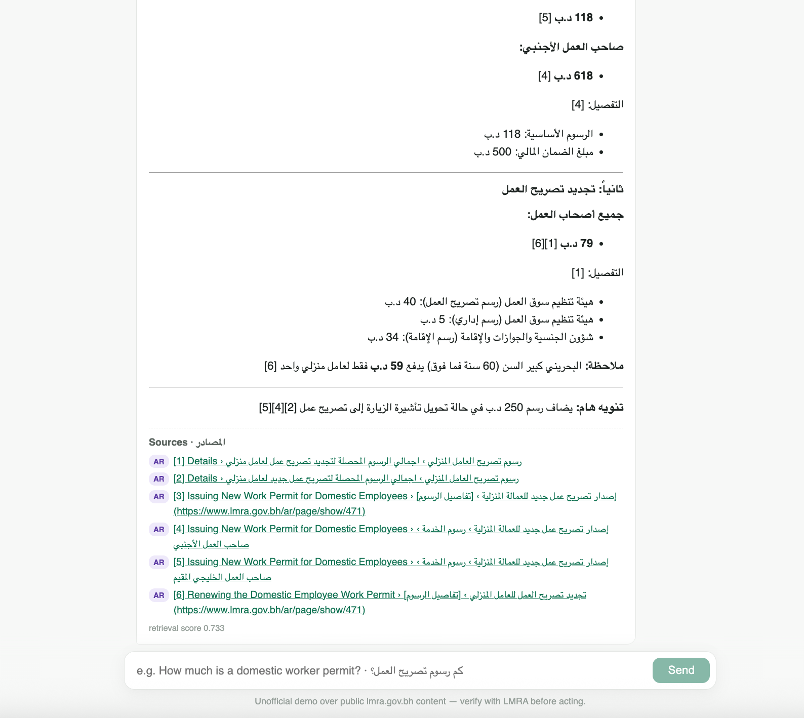
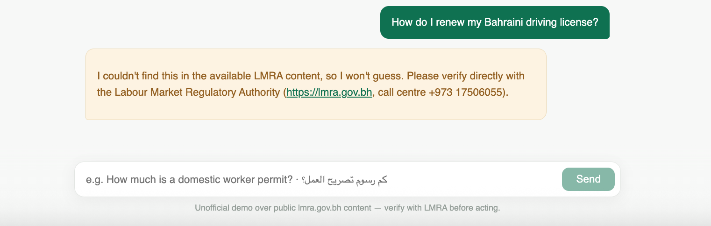

# Bilingual RAG over Bahrain's Labour Market Regulatory Authority (LMRA)

A retrieval-augmented assistant that answers questions about Bahraini work
permits and labour services **in English or Arabic**, retrieving from a
corpus that contains both — because some authoritative LMRA content (most
notably board resolutions and several laws) exists **only in Arabic**. Every
answer cites the official page it came from, and when the corpus doesn't
cover a question the system says so instead of guessing.

Built as a portfolio and learning project. The two design centers:
**cross-lingual retrieval** (the technically interesting part) and
**abstain-and-cite behaviour** (the part that makes civic information safe
to serve).

---

## Example interactions

**English question, bilingual sources** — the answer assembles from
whichever language version ranks best; note the AR badge on citation [1]:



**Arabic question, exact figures preserved** — full RTL answer with the
fee breakdown per employer type, all six citations pointing at the Arabic
fee tables:





**Out-of-corpus question — deterministic abstention, no improvisation:**



The flagship cross-lingual case: *"What does the law say about settlement of
labour market crimes?"* retrieves and correctly cites **قرار رقم (3) لسنة
2024 بشأن ضوابط وإجراءات التصالح** — a resolution that exists only in
Arabic — from an English question.

## Evaluation results

39 cases: 24 seeded from LMRA's own FAQ (whose answers link the exact
service page — free ground-truth citations), 9 curated cross-lingual cases
(expected source language ≠ query language, including Arabic-only laws),
6 out-of-corpus probes. Judge: claude-sonnet-4-5.

| metric | overall | EN | AR | cross-lingual |
|---|---|---|---|---|
| retrieval hit@6 | 33/33 | 18/18 | 15/15 | 9/9 |
| citation correct | 33/33 | 18/18 | 15/15 | 9/9 |
| faithfulness SUPPORTED | 32/33 | 17/18 | 15/15 | 9/9 |
| abstained on out-of-corpus | 6/6 | 3/3 | 3/3 | — |
| false abstention (answerable) | 0/33 | 0/18 | 0/15 | 0/9 |

The one faithfulness PARTIAL: an answer attributed LMRA's general call-centre
number to sources describing a different service — a real (minor) defect,
kept visible rather than tuned away.

### Held-out check

The table above is measured on cases the system was iterated against, so a
second set of 15 fresh questions (services and laws never touched during
development) was written and run **once**, results reported as-is:

| metric | held-out (single run) |
|---|---|
| retrieval hit@6 | 12/12 |
| citation correct | 10/10 |
| faithfulness SUPPORTED | 10/10 |
| abstained on out-of-corpus | 3/3 |
| false abstention (answerable) | **2/12** |

Everything the system *said* was correct and correctly cited, including the
cross-lingual cases (3/3). The two failures are false abstentions: two-part
questions ("what is the deportation deposit *and when is it refunded*")
where the correct page was retrieved at rank 1 but covers the question only
partially, and the safety-first refusal policy (any `[NOT_IN_SOURCES]`
marker → full abstention) converts a partial answer into a refusal. The
error is on the safe side — the user is pointed to LMRA, not misinformed —
but it is a real usefulness cost of the conservative design, documented
here rather than tuned away. (`eval/heldout.jsonl`, `eval/heldout_report.md`)

**What the eval caught during development** (why it's a first-class
deliverable, not an afterthought):

- A chunking bug that silently dropped section headings during small-section
  merges — including entire FAQ questions, making them unretrievable. Found
  because a "false abstention" metric existed to notice it.
- An answer that misattributed the human-trafficking hotline to the Expat
  Protection Centre. String-match metrics can't catch this; the LLM
  faithfulness judge did.
- LMRA's own EN and AR pages **disagree** in places (the tripartite contract
  is "Original" on the English page, «نسخة» /copy/ on the Arabic one) —
  a genuine data-quality finding about bilingual government content.

## How it works

```
crawl (manifest-driven, EN+AR)  →  extract (deterministic, structure-preserving)
  →  chunk (section-aware, tables atomic)  →  embed (BGE-M3, shared EN/AR space)
  →  retrieve (bilingual query expansion, exact cosine via one matmul)
  →  gate (relevance threshold → hard abstention)
  →  generate (grounding-only prompt, [n] citations)
  →  post-check (citation mapping; [NOT_IN_SOURCES] marker → fixed template)
```

```
crawler/crawl.py            two-stage polite crawler (discover → fetch), blacklist,
                            manifest as provenance record
pipeline/extract.py         HTML → markdown; #page_content scoping; fee tables
                            preserved; per-doc language detection; EN/AR pair links
pipeline/chunk.py           section-boundary chunks, breadcrumb headers, atomic tables
pipeline/embed.py           BGE-M3 dense vectors, L2-normalized
pipeline/store.py           the whole "vector DB": one normalized matrix + one matmul
pipeline/rag.py             expansion → gate → grounded generation → post-check
pipeline/test_crosslingual.py  EN↔AR retrieval battery + language-residual measurement
eval/build_testset.py       seeds test cases from the FAQ + curated sets
eval/run_eval.py            dataset-agnostic harness; --rescore relabels for free
app/api.py + app/index.html FastAPI wrapper + single-file React chat
```

### Setup

```bash
pip install -r requirements.txt
export ANTHROPIC_API_KEY=sk-ant-...

python crawler/crawl.py all          # ~10 min, polite 1.5s delays
python pipeline/extract.py
python pipeline/chunk.py
python pipeline/embed.py             # downloads BGE-M3 (~2.3 GB) once
python pipeline/test_crosslingual.py # cross-lingual gate
python eval/build_testset.py
python eval/run_eval.py              # full eval (LLM judge; ~$1-2)
python app/api.py                    # chat UI at http://localhost:8000
```

---

## Design choices, and why

**Cross-lingual retrieval via one shared embedding space.** BGE-M3 (XLM-R
backbone) is contrastively trained on translation and cross-lingual QA
pairs, which pulls an English query and an Arabic passage about the same
rule toward the same point in the vector space. Measured on this corpus:
parallel EN/AR chunk pairs sit at mean cosine **0.781** while random
cross-language pairs sit at **0.548** — and the "language residual" is tiny
(random same-language pairs score only ~0.03 higher than random
cross-language). Meaning dominates the geometry; language barely registers.
Chosen over multilingual-e5-large for its stronger Arabic retrieval and
8192-token window (no chunk truncation), and over hosted APIs to keep the
demo self-contained.

**Query-time bilingual expansion, not index-time glosses.** The hardest
case — casual English questions against Arabic-only legal prose — initially
failed (1/3 in the pre-fix battery). Fix: translate the query with a small
LLM call, embed both versions, score chunks by the max. The corpus stays
100% source text; no generated content enters the index of a civic-info
system. Post-fix: those exact cases retrieve at rank 1–2.

**Source whitelisting and a manifest-driven crawl.** Only lmra.gov.bh;
hub pages are used for link discovery, never as content; logins, booking
systems, and external portals are blacklisted by URL substring before they
can enter the manifest. The manifest doubles as a provenance record —
re-run discovery and diff it to detect new or removed services.

**Abstention enforced in three layers**, each catching what the previous
misses: (1) a retrieval-score gate — below threshold, the LLM is never
called, so there is nothing to hallucinate from; (2) a grounding-only
prompt that instructs refusal via an explicit `[NOT_IN_SOURCES]` marker;
(3) a citation post-check — an answer citing nothing is not treated as
fact. Refusals display a **fixed template**, not model prose: testing
showed the model names other authorities ("contact the Traffic
Directorate…") even when told not to — unverifiable outside knowledge.
Deterministic template = zero leakage.

**Evaluation as a first-class deliverable.** The harness is
dataset-agnostic (any JSONL of cases in the documented schema), separates
deterministic metrics (retrieval, citations, abstention — URL matching)
from judged ones (faithfulness — an LLM that sees only the chunks and the
answer), measures abstention in *both* directions (refusing out-of-corpus
questions AND not refusing answerable ones), and supports free re-scoring
when labels change. It caught two real bugs before any user could.

## Deliberate simplifications (v1)

- **One authority.** LMRA only. Work-permit questions bleed into visa/
  residency territory (NPRA), health (Wafid), and identity (IGA) — v1
  answers from LMRA content and abstains beyond it.
- **Modern Standard Arabic only.** The corpus is MSA; queries in Gulf
  dialect are out of scope (see future work).
- **Leaf-page HTML only.** No PDFs ingested. This cost less than expected:
  the full law texts turned out to be available as HTML. Informational
  guide PDFs (handbooks, multi-language guides) are inventoried in
  `data/clean/pdf_links.json` for a later pass.
- **Exact search over ANN indexing.** 1,133 chunks × 1024 dims is one
  matmul (~1 ms). FAISS/Chroma would add opacity and nothing else at this
  scale; the retrieval math stays visible.
- **Single-turn.** No conversation memory — each question stands alone.

## Genuine limitations & future work

- **Multi-hop FAQ pointers.** Some FAQ answers are just "see this page."
  If the pointed-to page doesn't independently rank, the system abstains
  honestly rather than following the link. Link-following retrieval (or
  indexing FAQ targets alongside the pointer text) is the fix.
- **Dialect handling.** A Bahraini asking «شقد رسوم الخدامة؟» is not served
  by MSA embeddings. Planned follow-up project: fine-tuning the embedding
  model on Gulf-dialect → MSA query pairs.
- **Coverage.** "Can I live and work in Bahrain?" spans LMRA + NPRA visa/
  residence content. v2 direction: add npra.gov.bh under the same
  manifest-and-whitelist pattern.
- **Freshness.** Fees change. The manifest records per-page fetch dates and
  LMRA publishes last-update stamps per page; a scheduled re-crawl + diff
  is the natural extension. Answers currently carry no staleness warning.
- **Known residuals.** One faithfulness PARTIAL (call-centre number
  attributed to an adjacent service's sources); LMRA's own EN/AR pages
  disagree in places, and the system has no mechanism to flag
  source-level contradictions to the user.
- **Scale of evidence.** 39 eval cases is a smoke test with teeth, not a
  benchmark. The harness is built to grow: add cases to
  `eval/testset.jsonl` (or point `--testset` at your own file) and re-run.

---

*Unofficial demo over public lmra.gov.bh content. Not affiliated with or
endorsed by LMRA. Always verify procedures and fees with LMRA directly
before acting.*
